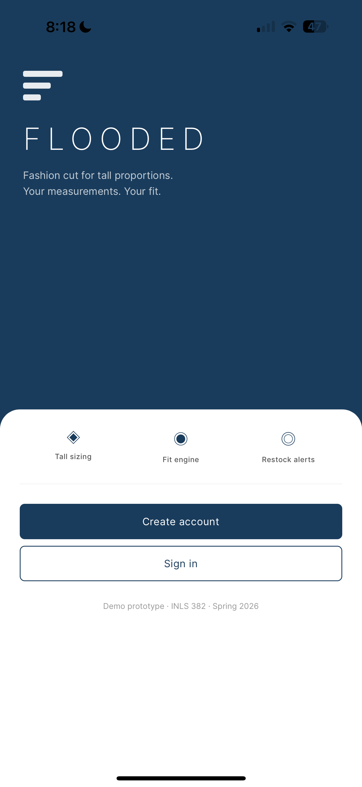
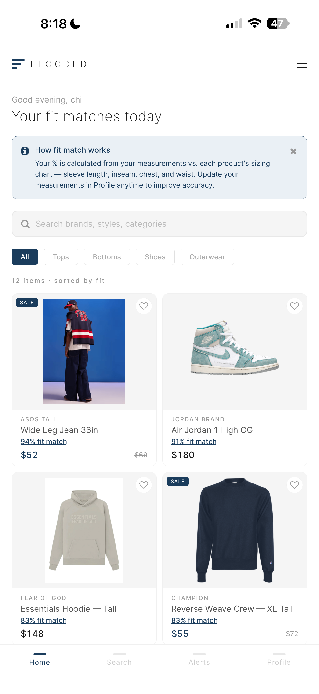
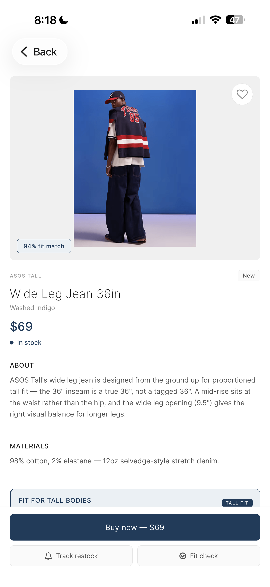
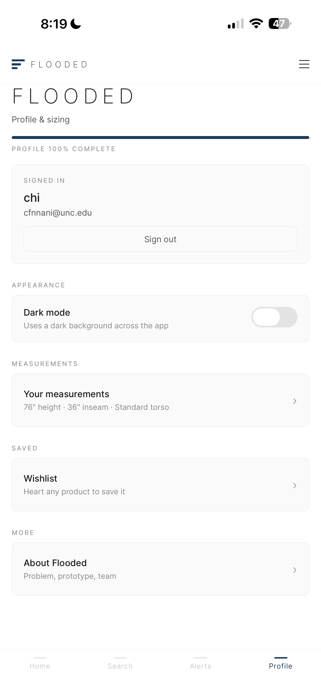
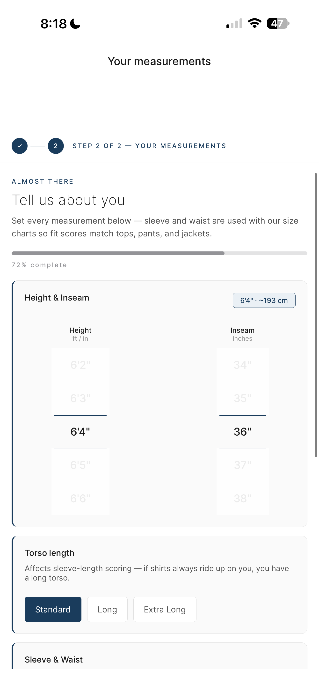
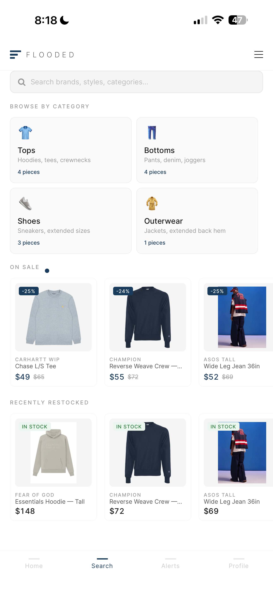
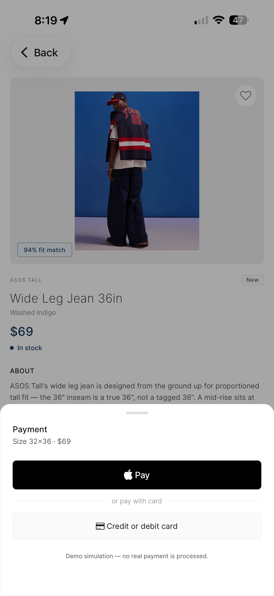
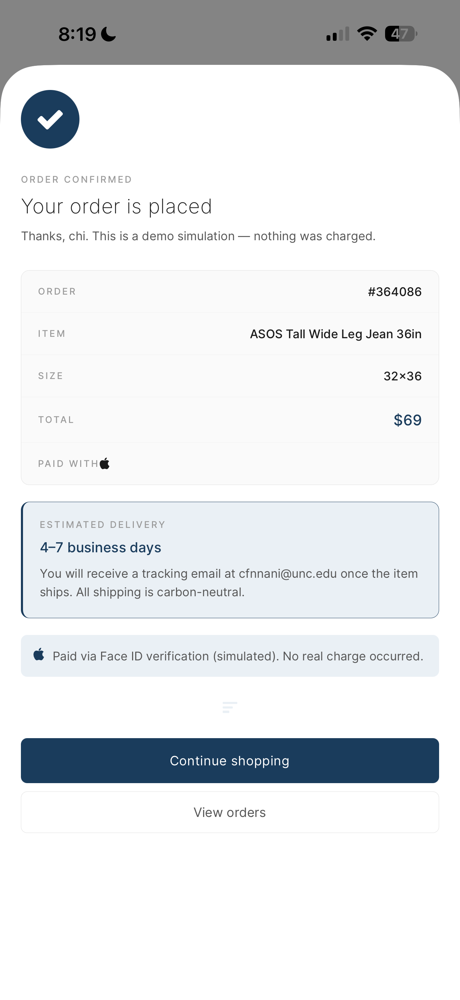

# Flooded: Tall-Fit Fashion Retail (Mobile Prototype)

**Repository:** [github.com/chigoziennani/flooded](https://github.com/chigoziennani/flooded)

## Overview

This repository is an **Expo + React Native** mobile app prototype for a premium **tall-fit** shopping experience: browse curated apparel and footwear, capture body measurements, see **fit-match scores** against size charts, track **stock and restock alerts**, and walk through a **demo checkout** flow—all with a minimal light UI and **local-only demo state** (no backend).

The project is intended to demonstrate:

- end-to-end mobile UX for tall sizing and fit transparency
- product discovery, detail, and wishlist patterns
- measurable profile setup (height, inseam, torso, and related fields)
- a cohesive design system (typography, spacing, brand accent)

> **Important:** This is a **design and UX prototype only**. It is not a production storefront, medical device, or real authentication or payment system.

## Technical Specifications

- **Runtime**: [Expo SDK 54](https://docs.expo.dev/) with **file-based routing** via [Expo Router](https://docs.expo.dev/router/introduction/)
- **UI**: React Native **0.81**, React **19**, **New Architecture** enabled in `app.json`
- **Navigation**: Stack + custom tab bar; auth gate redirects unauthenticated users to `welcome`
- **State**: React Context (`FloodedContext`) — session, measurements, wishlist, orders, stock simulation, fit scoring
- **Data**: Static catalog in `data/products.ts` (images under `assets/images/`)
- **Styling**: Shared tokens in `constants/Theme.ts` (light surfaces, deep ocean navy accent **#1A3C5C**), **Inter** via `@expo-google-fonts/inter`
- **Animation**: `react-native-reanimated` for transitions (e.g. home grid)
- **Typography / icons**: Custom font map in `constants/fonts.ts`; **FontAwesome** (`@expo/vector-icons`)

## Core Features

### Onboarding & Session

1. **Welcome flow** — Landing, optional demo **sign up** / **sign in** (local-only; any sample email works).
2. **First-run measurements** — New accounts are guided to **profile measurements** before entering the main tabs.
3. **Tab gate** — Until a session exists, `(tabs)` redirects to `/welcome`.

### Shopping & Discovery

1. **Home** — Product grid with **category filters** (e.g. tops, bottoms, shoes), inline search, **fit-match percentage**, **wishlist** toggles, and **stock** indicators (in stock / low / out).
2. **Search** — Dedicated search tab over the same catalog.
3. **Product detail** — Full description, materials, size chart, related **pairs**, and purchase path.
4. **Wishlist** — Saved items from the profile journey.

### Alerts (“Radar”)

1. **Tracked items** — Watch products and sizes; sections for **price drops**, **restocks**, and **watching**.
2. **Demo restock** — Simulate restock events to validate alert UX (local state only).

### Profile & Fit

1. **Measurements** — Height (drum picker), inseam, torso type, and related fields used by **fit scoring**.
2. **Height** — Dedicated height entry screen.
3. **Fit feedback** — Context supports fit notes and explainer dismissal for the match UI.

### Checkout (Demo)

1. **Confirm** — Modal checkout confirmation with placeholder payment choices (e.g. Apple Pay / card)—**no real charges**.

## Project Structure

```text
.
├── app/
│   ├── _layout.tsx              # Root stack, fonts, theme, screen registrations
│   ├── welcome.tsx              # Auth gate & demo sign-in / sign-up
│   ├── (tabs)/
│   │   ├── _layout.tsx          # Tabs + session redirect
│   │   ├── index.tsx            # Home (grid, filters, search, fit %)
│   │   ├── search.tsx           # Search
│   │   ├── radar.tsx            # Alerts / tracked items
│   │   └── profile.tsx          # Profile hub
│   ├── auth/
│   │   ├── sign-in.tsx
│   │   └── sign-up.tsx
│   ├── product/
│   │   └── [id].tsx             # Product detail
│   ├── profile/
│   │   ├── height.tsx
│   │   └── measurements.tsx
│   ├── checkout/
│   │   └── confirm.tsx          # Demo checkout modal
│   ├── wishlist.tsx
│   └── modal.tsx                # About / info modal
├── components/                  # AppHeader, AppTabBar, FloodedMark, DrumPicker, …
├── constants/
│   ├── Theme.ts                 # Colors, type scale, spacing
│   └── fonts.ts
├── context/
│   └── FloodedContext.tsx       # Global app state & fit/stock helpers
├── data/
│   └── products.ts              # Product catalog & helpers
├── utils/
│   └── categoryFilter.ts        # Category/spec filtering
├── assets/
│   └── images/                  # Catalog & branding assets
├── app.json                     # Expo config (name: Flooded, slug: flooded-prototype)
├── metro.config.js
├── package.json
├── tsconfig.json
└── README.md
```

## Running the Project

### Prerequisites

- **Node.js** 18+ (LTS recommended)
- **npm** or **yarn**
- For device testing: **Expo Go** on a physical phone, or **Android Studio** / **Xcode** simulators as usual for Expo

### Setup

```bash
git clone https://github.com/chigoziennani/flooded.git
cd flooded
npm install
```

If you keep a copy inside a monorepo subfolder (e.g. `mobile/`), `cd` into that folder before `npm install`.

Start the development server:

```bash
npm start
```

Then press **`i`** (iOS simulator), **`a`** (Android emulator), or scan the QR code with **Expo Go** (same LAN as your machine).

### Useful Scripts

| Script     | Command           | Description                      |
| ---------- | ----------------- | -------------------------------- |
| Dev server | `npm start`       | `expo start` — Metro + dev menu  |
| Android    | `npm run android` | Start with Android target        |
| iOS        | `npm run ios`     | Start with iOS simulator (macOS) |
| Web        | `npm run web`     | Experimental web build via Expo  |

### Typecheck

```bash
npx tsc --noEmit
```

## Screenshots

Device captures live in `docs/screenshots/`. Below is a **curated set** for the README; the rest are still useful for decks or docs.

**Best for the repo overview (story + visuals):**

| File           | Why include                                                                                |
| -------------- | ------------------------------------------------------------------------------------------ |
| `IMG_7521.PNG` | **Welcome** — brand, value props (tall sizing / fit / alerts), CTAs, course footer         |
| `IMG_7524.PNG` | **Home** — fit-match %, search, category chips, product grid (hero shot for the prototype) |
| `IMG_7525.PNG` | **Product detail** — hero image, fit match, buy / track / fit check                        |
| `IMG_7529.PNG` | **Profile** — session, dark mode, measurements summary, wishlist, About                    |

**Strong additions for a second row (flow & depth):**

| File           | Why include                                                                                   |
| -------------- | --------------------------------------------------------------------------------------------- |
| `IMG_7523.PNG` | **Onboarding measurements** — drum pickers, torso, progress (core differentiator)             |
| `IMG_7527.PNG` | **Search** — browse-by-category, sale and restock rails                                       |
| `IMG_7531.PNG` | **Demo checkout** — payment sheet + _“Demo simulation — no real payment”_ (sets expectations) |
| `IMG_7533.PNG` | **Order confirmed** — end of funnel, demo copy                                                |

<p align="center">
  
  
  
  
</p>
<p align="center">
  
  
  
  
</p>

## What Stays Out of Git

The repo’s `.gitignore` excludes **`node_modules/`**, **`.expo/`**, build outputs, local env files, IDE junk, and native **`ios/`** / **`android/`** folders generated by prebuild. Commit **`package-lock.json`** so installs are reproducible.

If you add API keys later, use **`.env`** (ignored) and commit a **`.env.example`** with dummy keys only.

## Team Credits

Made with ❤️ by **Chigozie Nnani**.
Project created with **Adedunmola Adeniyi** & **Chichere Ogbuebile**.

## License & Ethics

This software is provided for **portfolio, educational, and demonstration** purposes only.  
It does **not** provide medical sizing advice, financial services, or a real marketplace. Do **not** use it for clinical decisions or as a substitute for professional fitting or healthcare guidance.
